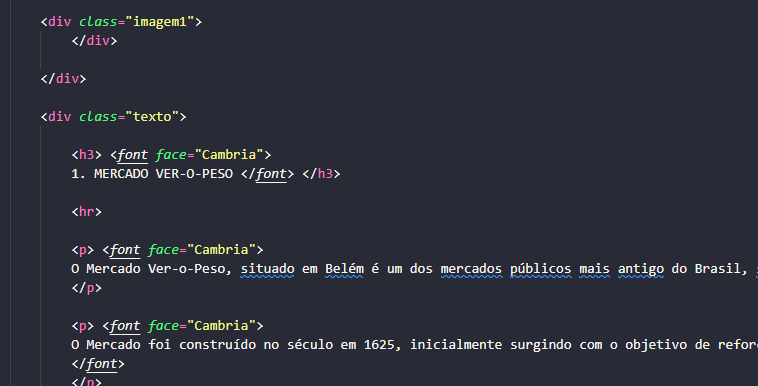

# 5 pontos turisticos de Belém/PA
Um projeto simples desenvolvido durante a disciplina de Desenvolvimento Web da Faculdade.

# Objetivo
Criação de um site dinamico e informativo sobre os pontos turistico da cidade descrevendo brevemento cada lugar, sua importância e seu contexto histórico na construção da cidade.

# Layout

# Tecnologias
* HTML
* CSS

Aliada a ferramenta PARALLAX do CSS, gera-se uma rolagem dinámica e interativa das imagens durante a passagem dos textos de cada imagem

# Modo de uso
Abrir em qualquer navegador com internet

## Estrutura do Código
Na estrutura do HTML foram usadas classes iguais pra cada item ou seja, as estilizações no CSS foram definidas em conjunto não havendo exagero de código.
 

Na parte de adicionar as imagens colocamos diretamente todas elas no CSS, de forma simples e direta até mesmo pra simplificar código
e com apenas algumas linhas acrescentar a ferramenta do PARALLAX, que é super facil de se utilizar.
 

# Editores de código:
* VSCODE
* SUBLIME

